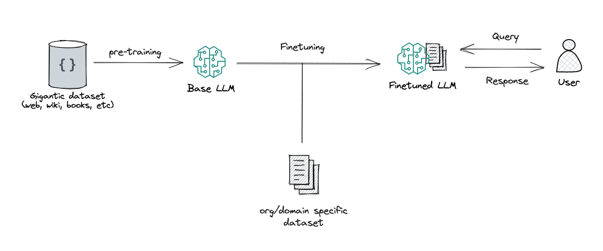
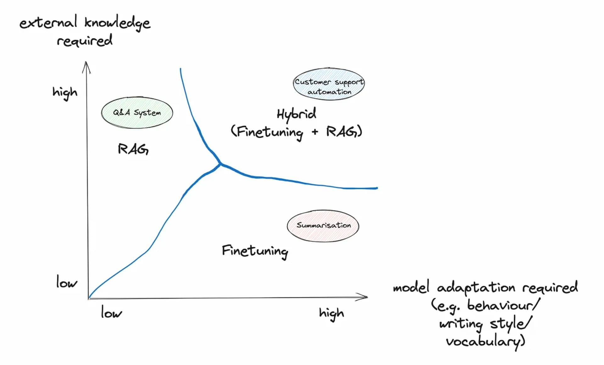
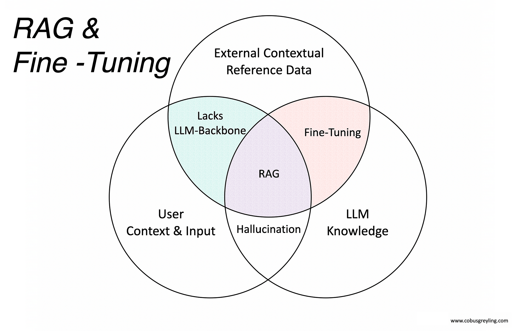

# Entendendo LLMs: Prompt Engineering, RAG e Fine-Tuning

## 1. Prompt Engineering

Prompt Engineering é a arte e a ciência de criar requisições (prompts) eficazes para modelos de linguagem, a fim de obter as respostas desejadas. A qualidade da saída do modelo depende diretamente da qualidade do prompt.

## 2. Retrieval-Augmented Generation (RAG)

RAG é uma arquitetura que melhora a capacidade dos LLMs de gerar respostas mais precisas e baseadas em comnhecimentos externos especificos. Ela é uma solução para a limitação do conhecimento intrínseco do modelo.

**Como Funciona:**

1.  **Consulta do Usuário (Query):** O usuário envia uma pergunta ou prompt para um sistema de QA.

```
"Quais são os benefícios do Fine-Tuning em modelos de linguagem?"
```

2.  **Busca (Search):** O sistema realiza uma busca em um conjunto de dados externos (base de conhecimento da organização, documentos específicos, etc.) para encontrar informações relevantes.

3.  **Aumento do Prompt:** A consulta original do usuário é combinada com os documentos relevantes recuperados.

```
"Quais são os benefícios do Fine-Tuning em modelos de linguagem?

Baseado nos documentos encontrados: 'Fine-Tuning permite adaptar o modelo para um comportamento específico, melhora o desempenho em tarefas específicas e alinha o modelo a nuances de um domínio particular.'"
```

4.  **Geração da Resposta:** Este prompt "aumentado" é enviado ao LLM base, que gera uma resposta mais informada e contextualizada.

**Vantagens:**

* Reduz alucinações ao fornecer dados factuais externos.
* Permite que o LLM acesse e use informações que não estavam presentes em seus dados de treinamento.
* Ideal para sistemas de QA que exigem alto conhecimento externo.

**Diagrama do Processo RAG:**


## 3. Fine-Tuning

Fine-Tuning (Ajuste Fino) é o processo para adaptar seu comportamento, estilo de escrita ou vocabulário a uma tarefa ou domínio particular.

**Vantagens:**

* Adapta o modelo para um comportamento, estilo de escrita ou vocabulário específico.
* Melhora o desempenho em tarefas onde o modelo precisa se comportar de uma forma especifica.

**Diagrama do Processo de Fine-Tuning:**



---

## 4. RAG vs. Fine-Tuning: Quando Usar?

A escolha entre RAG e Fine-Tuning (ou uma combinação) depende dos requisitos da aplicação:

* **RAG:** É ideal quando o conhecimento externo é altamente necessário.
* **Fine-Tuning:** É mais adequado quando é necessária uma adaptação do comportamento do modelo.

**Hibridização (RAG + Fine-Tuning):**

Ambos podem ser aplicados ao mesmo tempo, resultando em uma abordagem híbrida que combina Fine-Tuning e RAG pode ser a mais eficaz, aproveitando os benefícios de adaptar o modelo ao comportamento desejado e fornecer conhecimento externo.

**Diagrama de Comparação RAG & Fine-Tuning:**



---


