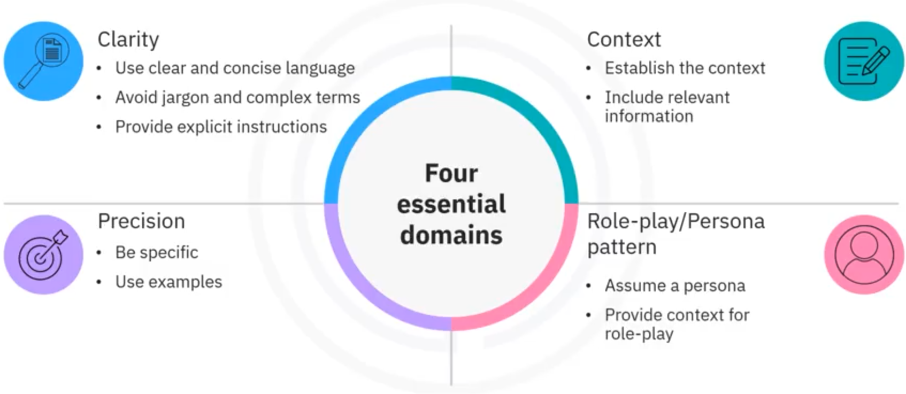
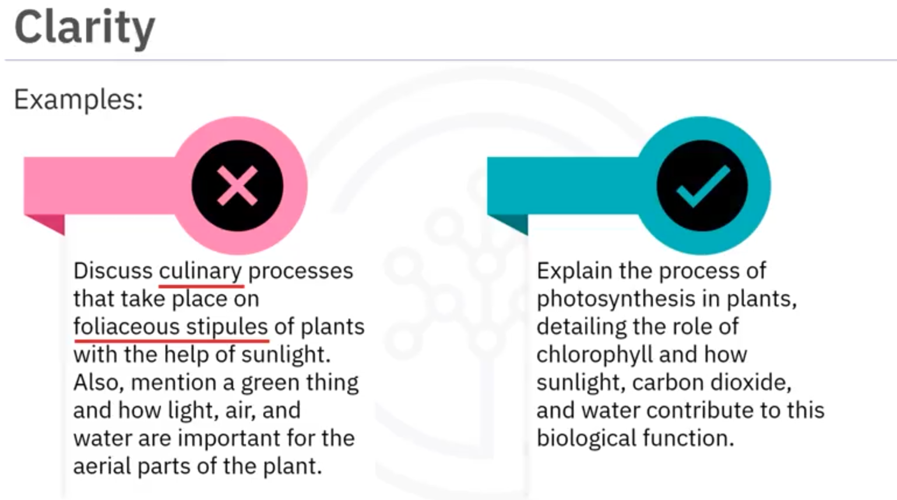
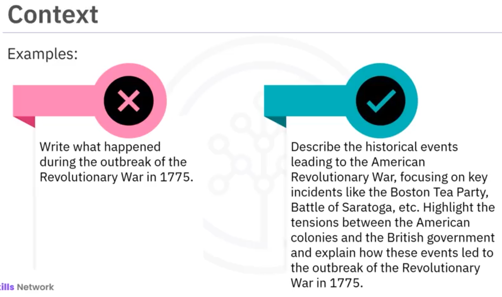
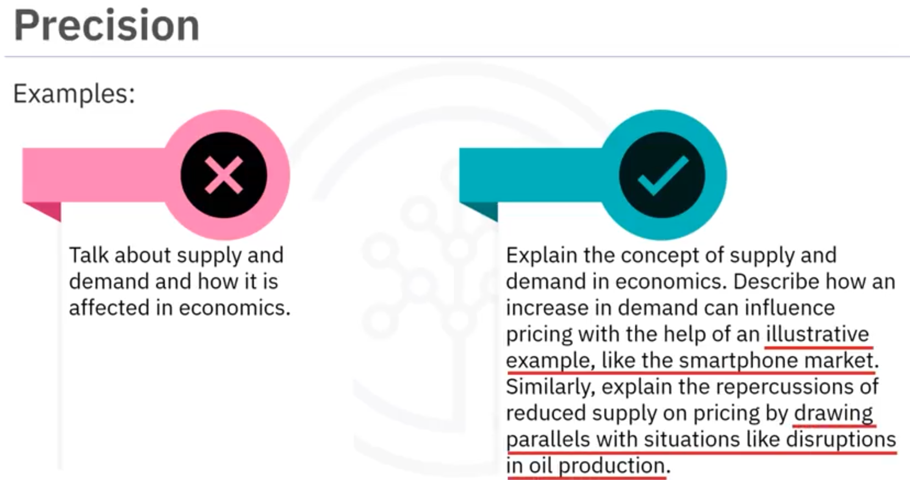
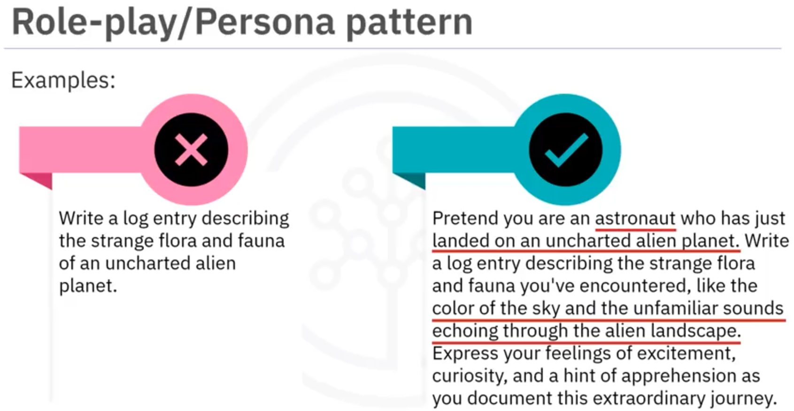

# componentes e boas práticas

um prompt, no geral, pode conter qualquer um dos seguintes componentes:

* **Instrução** – uma tarefa ou instrução específica que você deseja que o modelo execute.
* **Contexto** – pode envolver informações externas, o porquê vocẽ está fazendo, o que você quer com aquela tarefa, onde será usado o resultado...
* **Dados de entrada** – é a entrada ou pergunta para a qual estamos interessados em encontrar uma resposta.
* **Indicador de saída** – indica o tipo ou formato da saída.

> **nem todos os componentes são obrigatórios**, e o formato ideal do prompt depende da tarefa.

## um bom prompt

a qualidade de um prompt, superficialmente, pode ser alcançada analisada em 4 critérios:

### 1. claridade

### 2. contexto

### 3. precisão

### 4. Role Play / Persona Pattern

