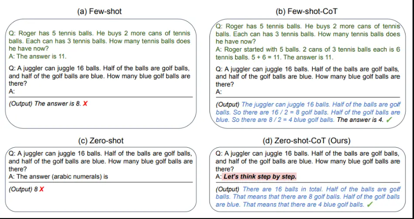
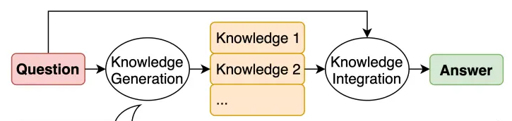

# Técnicas

Base prática e direta sobre técnicas de engenharia de prompt.

## 1. Interview Pattern

É usado para o próprio modelo pedir o contexto necessário para a tarefa. Antes de responder, o modelo pedirá uma serie de respostas (contextos) para enriquecer a análise. O Isso ajuda a refinar progressivamente a solicitação e obter respostas mais direcionadas.

**(Questão a Questão):**

```

You will act as a seasoned travel expert. Your objective is to engage in a comprehensive trip-planning session with me. Begin by asking a series of detailed questions, one at a time, to gather all the essential information required to craft the most tailored and memorable travel itinerary based on my specific preferences, interests, and budget.

```

**(Bloco de Questões):**

```

You will act as a fitness expert who is current with the latest research data and provide very detailed step-by-step instructions in reply to my queries. You will interview me, asking me all the relevant questions necessary for you to generate the best possible answer to my queries.

Create a gym workout program to lose weight and build strength.

```

**Tarefa:**
1.  Crie um prompt usando o "Interview Pattern" para ajudar um empreendedor de primeira viagem a achar a ideia ideal.


## 2. Zero-Shot Prompting

É básicamente a forma que todo mundo está acostumado a interagir com os modelos. Apenas colocando a tarefa e algumas informaçẽos sobre.

**Prompt:**
```

Resuma o seguinte texto em três frases:
"A engenharia de prompt é uma técnica crucial para otimizar a interação com modelos de linguagem. Envolve a criação de prompts eficazes que direcionam o modelo a gerar respostas precisas e relevantes. Ao utilizar diferentes técnicas de prompt, podemos melhorar significativamente o desempenho do modelo em diversas tarefas."

```

**Tarefa:**
1.  Faça um prompt Zero-Shot, usando o que você aprendeu sobre baos práticas de prompt.

## 3. Few-Shot Prompting

Few-shot prompting fornece alguns exemplos ao modelo para demonstrar o resultado desejado e/ou como o modelo deve resolver a tarefa.

**Prompt:**
```
Faça uma análise do feedback recebido pelos clientes na minha startup. Quero que você me diga o que fazer com base nele.

Q: "O produto é bom, mas a navegação no site é confusa."
A: Repense na jornada do cliente.

Q: "O suporte ao cliente foi excelente e rápido."
A: Mantenha a qualidade do atendimento.

Q: "O produto chegou danificado e demorou muito."
A: Revise o produto e a logística.

Q: "O preço é alto, mas a qualidade justifica."
A: Avalie a estratégia de preços.

Q: "A variedade de produtos é ótima, mas faltam opções para tamanhos maiores."
A: Expanda a linha de produtos.

Q: "O aplicativo trava com frequência e a interface é poluída."
A:

```

**Tarefa:**
1.  Crie um prompt de few-shot para avaliar a qualidade de perguntas planejadas para a entrevista com clientes.

## 4. Chain of Thought (CoT)

Estimula etapas intemediárias de raciocínio. É interessante ser combinada com Few-Shot.

**Prompt:**
```
Q: Ideia de Negócio: Serviço de entrega de refeições saudáveis e orgânicas em São Paulo.
A: Para calcular o TAM, precisamos considerar o mercado total de refeições em São Paulo. Supondo que 10 milhões de pessoas comam fora regularmente e que o gasto médio por refeição seja R$30, o TAM anual seria 10.000.000 x R$30 x 365 = R$109.5 bilhões. O SAM seria a parcela desse mercado que busca refeições saudáveis e orgânicas, estimado em 10%, ou R$10.95 bilhões. O SOM seria a parcela que nossa empresa pode realisticamente atingir, considerando capacidade e concorrência, estimado em 1%, ou R$109.5 milhões.

Q: Ideia de Negócio: Aplicativo de aprendizado de idiomas personalizado com IA.
A: Para o TAM, consideramos o mercado global de aprendizado de idiomas online. Supondo que 500 milhões de pessoas aprendam idiomas online e que o gasto anual médio seja US$100, o TAM seria 500.000.000 x US$100 = US$50 bilhões. O SAM seria a parcela para aprendizado personalizado com IA, estimado em 20%, ou US$10 bilhões. O SOM seria a parcela que nossa empresa pode atingir, considerando a concorrência e o marketing, estimado em 5%, ou US$2.5 bilhões.

Q: Ideia de Negócio: Plataforma online para conectar freelancers com projetos remotos no Brasil.
A: Para o TAM, consideramos o mercado de trabalho freelancer no Brasil. Supondo que 10 milhões de freelancers atuem no Brasil e que a receita anual média por freelancer seja R$50.000, o TAM seria 10.000.000 x R$50.000 = R$500 bilhões. O SAM seria a parcela para plataformas online que conectam freelancers com projetos remotos, estimado em 30%, ou R$150 bilhões. O SOM seria a parcela que nossa plataforma pode atingir, considerando a concorrência e a especialização, estimado em 10%, ou R$50 bilhões.

Q: Ideia de Negócio: Serviço de assinatura de caixas de produtos de beleza veganos e sustentáveis.
A: Para o TAM, consideramos o mercado de cosméticos no Brasil. Supondo que o mercado seja de R$100 bilhões e uma parcela de 20% para produtos de beleza veganos e sustentáveis, o TAM seria de R$20 bilhões. O SAM seria a parcela desse mercado para serviços de assinatura, que estimamos em 15%, resultando em um SAM de R$3 bilhões. O SOM seria a parcela que nossa empresa poderia alcançar com marketing eficaz e diferenciação, estimado em 5%, resultando em um SOM de R$150 milhões.

Q: Ideia de Negócio: Aplicativo móvel para agendamento e pagamento de serviços de beleza em salões locais.
A: Para o TAM, consideramos o mercado de serviços de beleza em salões nas principais cidades do Brasil. Supondo que existam 50 milhões de clientes potenciais e um gasto anual de R$1000 por cliente, o TAM seria de R$50 bilhões. O SAM seria a parcela desse mercado que utiliza agendamento online, que estimamos em 40%, resultando em um SAM de R$20 bilhões. O SOM seria a parcela que nosso aplicativo poderia capturar com uma boa estratégia de marketing e funcionalidades, estimado em 10%, resultando em um SOM de R$5 bilhões.

Q: Ideia de Negócio: Plataforma de e-commerce especializada em produtos artesanais e locais.
A:
```

### few-shot vs zero-shot



**Tarefa:**
1.  Use Chain of Thought prompting para mapear as dores, criar hipoteses e planejar testes de baixo custo.

---

## 7. Tree of Thoughts

Permite ao modelo explorar múltiplos caminhos de pensamento, como uma árvore, para resolver problemas complexos.


**Prompt:**
```
Imagine three different experts answering this question. All experts will write down 1 step of their thinking, and then share it with the group. Then all experts will go on to the next step, etc. If any expert realizes they're wrong at any point, then they leave.

Act as a human resource specialist, design a recruitment and retention strategy for an e-commerce business, focusing on attracting and retaining skilled remote employees.
```

**Tarefa:**


## 8. Generate Previous Knowledge

**Explicação:**
Envolve gerar conhecimento relevante antes de responder à pergunta, melhorando a precisão do modelo. Podemos usar few-shot para gerar conhecimento de uma maneira especifica.



**Prompt Conhecimento:**
```
Input: A common effect of smoking lots of cigarettes in one’s lifetime is a higher than normal chance of getting lung cancer.
Knowledge: Those who consistently averaged less than one cigarette per day over their lifetime had nine times the risk of dying from lung cancer than never smokers. Among people who smoked between one and 10 cigarettes per day, the risk of dying from lung cancer was nearly 12 times higher than that of never smokers.
Input: A rock is the same size as a pebble.
Knowledge: A pebble is a clast of rock with a particle size of 4 to 64 millimetres based on the Udden-Wentworth scale of sedimentology. Pebbles are generally considered larger than granules (2 to 4 millimetres diameter) and smaller than cobbles (64 to 256 millimetres diameter).
Input: Part of golf is trying to get a higher point total than others.
Knowledge:
```

**Prompt:**
```
Question: Part of golf is trying to get a higher point total than others. Yes or No?
Knowledge:
```

> ⚠️ **Os resultados podem melhorar ou piorar**. O conhecimento gerado por LLMs nem sempre é útil ou verídico. Sempre que possível, insira conhecimentos prévios confiáveis para obter melhores resultados.

**Tarefa:**
1.  Use GENKNOW  para gerar um mapa de tendências e oportunidades
2.  Use o conhecimento gerado para encontrar uma ideia de negócio com propósito

## 9. Prompt Chaining (Dividindo em Subtarefas)

Dividir uma tarefa complexa em subtarefas menores, onde a saída de um prompt serve como entrada para o próximo. É uma ótima prática para tarefas muito complexas.

Sempre se pergunte o seguinte: **"Um ser humano executa essa tarefa executando apenas uma coisa?"** se a resposta for não, é um bom indicio que a tarefa deve ser dividida para obter melhores resultados.

**Prompt 1 (sub-tarefa):**
```
Você é um especialista em empreendedorismo. Sua tarefa é ajudar a responder a perguntas com base no seguinte documento.
O primeiro passo é identificar o capítulo relevante na estrutura do documento.
Forneça o capítulo ou capítulos relevantes usando a tag \<chapters\>\</chapters\>.

Estrutura do documento:
{
Capítulo 1: A Transição da Mentalidade Corporativa para a Empreendedora:
Capítulo 2: Encontrando e Validando Ideias com Potencial
Capítulo 3: Entendendo Seu Cliente
Capítulo 4: Definindo sua Proposta de Valor Única
Capítulo 5: O Poder do Produto Mínimo Viável (MVP)
Capítulo 6: Medindo e Aprendendo com o Feedback
Capítulo 7: Desenhando o Modelo de Receita
Capítulo 8: Encontrando Seu Mercado (Novamente!)
Capítulo 9: Adquirindo Seus Primeiros Clientes
Capítulo 10: Construindo um Time Forte (Mesmo que Inicialmente Pequeno)
}

Pergunta: {prompt}
```

**Prompt 2 (tarefa final):**
```

Dado um conhecimento relevante extraido de um playbook de empreendedorismo, componha uma resposta à pergunta.
Certifique-se de que a resposta seja precisa, com tom amigável e útil.

Pergunta: {prompt}
```

**Tarefa:**

1.  Quais são os problemas que podem ser observados nos prompts utilizados como exemplo?
2. Faça um exemplo de Prompt Chaining para criar um assistente de vendas cuja função redigir um cold email personalizados para os clientes

-----
